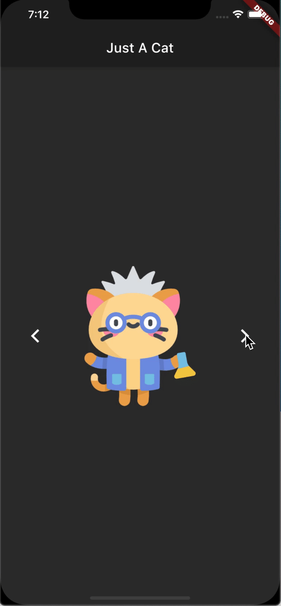

# Just A Cat

Scaffold application to show a cat image. 

I created this app, to learn in Flutter project, how to:
- use Scaffold Widget in Flutter
- make swipe gesture detector
- update the stateful widget
- import images to the project
- change the app name
- change the app icon
- update the widget with animation

## Images
Icons made by [Freepik](https://www.flaticon.com/br/autores/freepik) from [Flaticon](www.flaticon.com)
